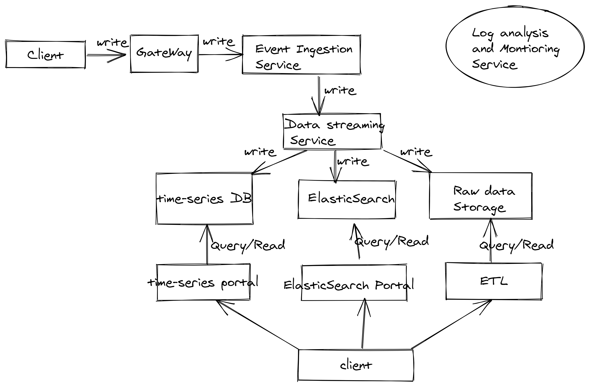

### Requirements

1. Handle large write volume: Billions of write events per day.
   Thought: Assume write TPS is about 1B/(24*60*60) = 11575 
2. Handle large read/query volume: Millions of merchants wish to gain insight into their business. 
   Read/Query patterns are time-series related metrics.
   Thought: a time-series DB may be useful.
3. Provide metrics to customers with at most one hour delay.
   At most one hour delay, not a huge latency.
4. Run with minimum downtime.
   Assume SLA is 99.9%
5. Have the ability to reprocess historical data in case of bugs in the processing logic.

### Components Diagram
Assume each component will onboard log analysis and monitoring service for log tracing.
Log analysis and monitoring service could use 3rd party provided solution such as AWS Cloudwatch.

### Gateway
Gateway component is used to do all the SSL terminations and Authentications, Throttling rate Config, etc.:
#### Tech stack
##### 1. AWS API gateway - Recommended
pros: Aws managed service, will help you handle all the above. Easy to integrate with other AWS service
cons: cost much
##### 2. Custom Solution using AWS ECS/EC2 with LB.
pros: flexible, low cost.
cons: scaling might cause a lot of pain, considering the TPS is 11575.

### Event Ingestion Service.
Event Ingestion Service is used to stream billions of events per second from any source into any endpoint
#### Tech stack
##### 1. AWS Lambda
pros: Aws managed service, serverless,
cons: cold start -- high latency, cost much - considering high TPS.
##### 2. AWS ECS(Fargate) with LB - Recommended
pros: low latency, using container. Easy to manage.
cons: less cost.

### Data Streaming Service.
Data Streaming Service is used to stream billions of events per second from any source into Storage.
#### Tech stack
##### 1. AWS Kinesis - Recommended.
pros: Aws managed service easy to setup, real time low latency with high availability.
cons: easy to maintain, cost much, has more limitations such as a maximum 7-day retention period
##### 2. Kafka
pros: flexible with multiple configurations.
cons: less cost. more time to set up and manage the fleet.
##### Discussion:
if 7-day retention period is not the big concern, then kinesis seems better.

### Data storage layer
time-series DB is used to store events into time-series data for a query. 
time-series portal is the gateway to access this time-series DB for clients.
ElasticSearch is used to query numerical data or textual data.
time-series portal is the gateway to access this elasticSearch for clients.
raw data storage is used to store the raw data to do more complex and not real-time analysis(data lake concept).
#### Tech stack
##### 1. time-series DB, Example: InfluxDB
pros: suitable for time-series query. if query is time sensitive, influxDB
cons: needs to manage its infra, new DataBase.
##### 2. ElasticSearch
pros: suitable for querying textual data and easy to integrate with other open source tool such as other stuff.
##### 3. Raw data Storage Example: S3.
pros: S3 is the largest and most performant object storage service for structured and unstructured data and the storage service of choice to build a data lake.
##### 4. ETL
Aws Step Functions:

pros:

1. Fully managed by AWS.
2. No single point of failure. The scheduler is clustered on the AWS side natively.
3. Easy and native integration with the most cutting edge serverless implementations including Lambda.
4. Also supports connecting to a self-managed micro-service using the AWS API.

cons:
1. Not open source. Cannot be reused in a non-AWS environment.

Airflow:

pros:
1. Airflow has a large and active open source community.
2. UI is probably the best among all ETL platforms in the market.
3. It is open source so works with any cloud provider.

cons:
1.  Single point of failure for the scheduler.
2.  Have to maintain the AirFlow server by ourselves.

#### Discussion
Because of the wide use case of our customers, so we introduce 3 different storage solutions for our customers. 
One is time-series DB, elastic search and raw data solutions. time series DB is used for query time related query and elastic search is used for content based query. Raw data with ETL solution is providing custom complex query.